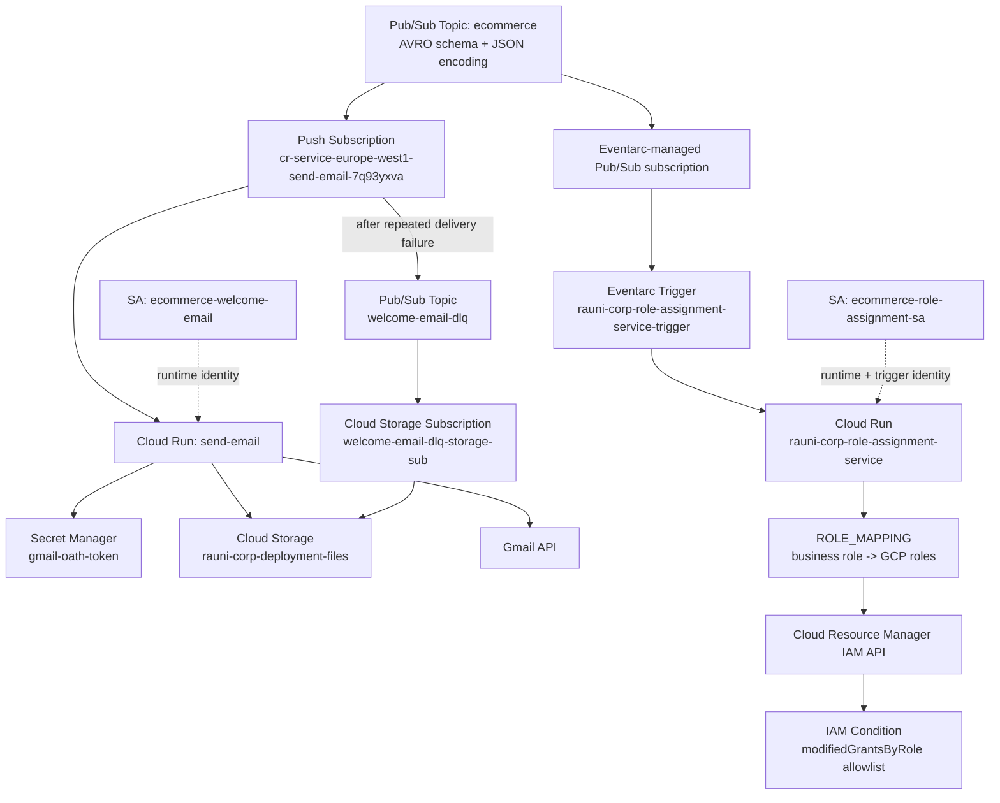

# Rauni R Corp — Event-Driven Onboarding Architecture

## Security model

The role-assignment path intentionally has two layers:

1. **Application decision layer** — a Python `ROLE_MAPPING` converts business job roles into approved Google Cloud roles.
2. **Platform enforcement layer** — the runtime service account receives only a custom role containing `getIamPolicy` and `setIamPolicy`, with an IAM Condition that restricts modified grants to `roles/viewer` and `roles/logging.viewer`.

This means application logic is not treated as the final security boundary.
