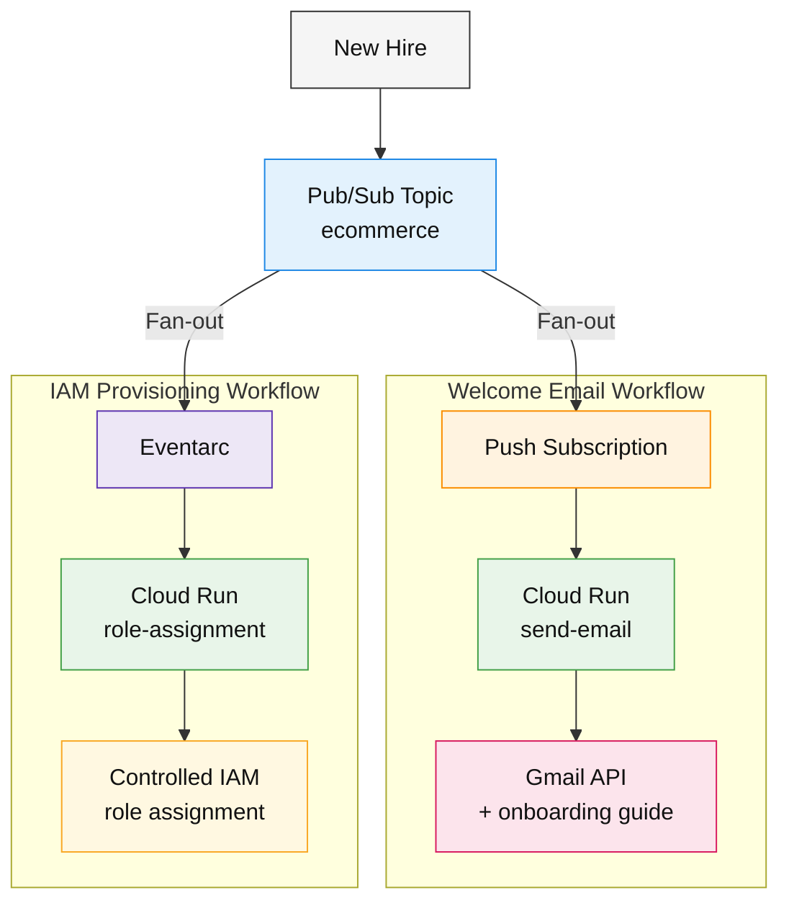
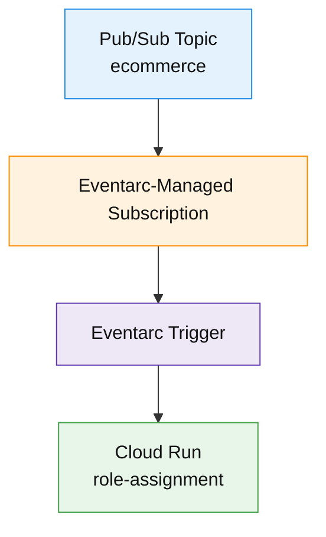
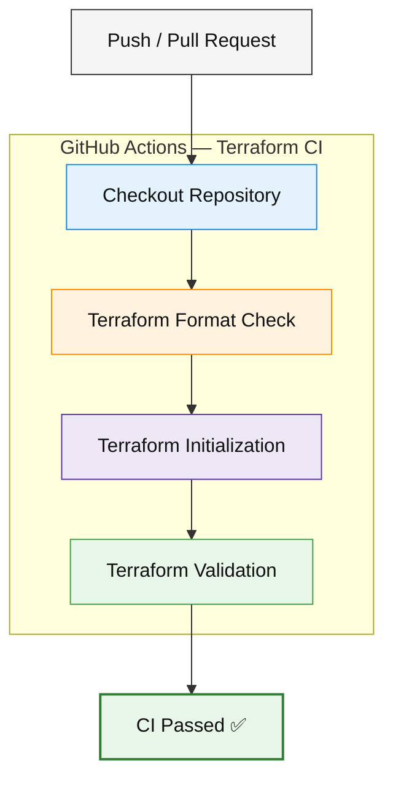
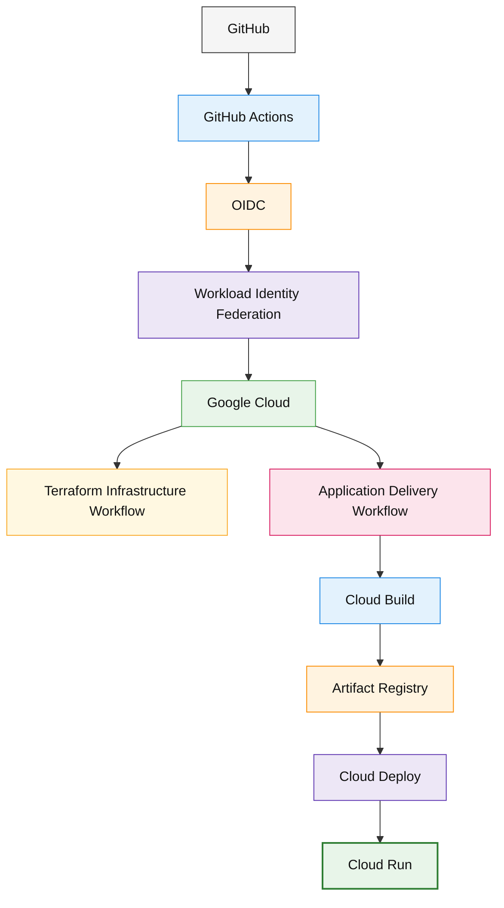

# 👋 Welcome Project — Event-Driven Employee Onboarding on GCP

**Rauni R Corp** is a fictional company used as the case scenario for this cloud engineering project.

The goal is to automate the first steps of a new employee's onboarding journey through a **fan-out, event-driven architecture on Google Cloud**, combining welcome communication, IAM access provisioning, dead-letter handling, Infrastructure as Code, and automated CI validation.


> 🌱 **Spiritual successor to [Project Garden](https://www.rauniribeiro.com/project-garden)** — an earlier AWS portfolio project focused on decoupled cloud automation.  
> Welcome Project evolves that idea into a more mature GCP case study centered on event-driven onboarding, IAM automation, brownfield Terraform adoption, and CI.

---

## 🎯 Case scenario

A new employee joins **Rauni R Corp**.

Instead of relying on multiple disconnected manual onboarding tasks, a single onboarding event is published to Google Cloud Pub/Sub.

That single event is then **fanned out into independent workflows**.

> 🔀 **Fan-out architecture:** one onboarding event is published once to Pub/Sub and distributed to multiple independent consumers. Each consumer owns a separate responsibility and can evolve, fail, or scale without tightly coupling the other workflow.

In this project, the same onboarding event branches into:
- 📨 a **Welcome Email workflow**
- 🔐 an **IAM Provisioning workflow**

This is the core architectural pattern behind the project:




### 🔀 Why this is a fan-out pattern

The **Pub/Sub topic acts as the fan-out point**. A single `ecommerce` onboarding event is published once, but multiple downstream consumers react to that event through separate delivery paths.

The Welcome Email path is delivered through its push subscription, while the IAM Provisioning path is delivered through the Eventarc-managed Pub/Sub transport subscription. The publisher does not need to know how many consumers exist or what each consumer does.

This keeps the onboarding platform **decoupled and extensible**: a future workflow — such as account creation, ticket generation, asset provisioning, analytics, or HR notifications — could subscribe to the same onboarding event without modifying the original publisher.

The architecture therefore demonstrates how **one business event fans out into multiple independent serverless workflows** while maintaining dedicated identities, restricted permissions, failure handling, and infrastructure traceability.

---

## ☁️ Project goals

The project was designed to demonstrate:

- 🔀 Fan-out event-driven architecture using Pub/Sub and Eventarc
- 📨 Automated employee welcome communication
- 🔐 Automated IAM provisioning with controlled authorization boundaries
- ☁️ Serverless workloads running on Cloud Run
- ☠️ Dead-letter handling and persistent failure storage
- 🔑 Secure secret separation using Secret Manager
- 👤 Dedicated service accounts and least-privilege-oriented IAM
- 🧱 Brownfield Infrastructure as Code adoption with Terraform
- ✅ Automated Terraform CI using GitHub Actions
- 📚 Architecture documentation and reproducible infrastructure definitions

---

## 🏗️ What is modeled in Terraform

Terraform reconstructs and manages the infrastructure supporting the onboarding platform:

- 📬 Pub/Sub topic `ecommerce`
- 🧬 AVRO schema `ecommerce_order_schema`
- 📩 Welcome-email push subscription
- ☠️ Welcome-email DLQ topic
- 🗄️ DLQ -> Cloud Storage subscription using AVRO
- ☁️ Cloud Run `send-email`
- ☁️ Cloud Run `rauni-corp-role-assignment-service`
- ⚡ Eventarc role-assignment trigger
- 🔄 Eventarc transport through the existing `ecommerce` topic
- 👤 Dedicated runtime service accounts
- 🔐 Custom project IAM role
- 🛡️ Conditional IAM binding using `modifiedGrantsByRole`
- 🔑 Secret Manager secret metadata only
- 🪣 Deployment / DLQ Cloud Storage bucket
- 🤖 Pub/Sub service-agent permissions required by the DLQ path

The repository also contains the Python source code for both onboarding workloads under `services/`.

---

## 🚫 What is intentionally NOT modeled

- Secret Manager **secret versions / secret payloads**
- OAuth refresh tokens
- Raw `token.json`
- Unrelated Google Cloud ACE labs
- Cloud Run source-upload/build buckets and generated build metadata
- The Eventarc-generated Pub/Sub subscription as an independent Terraform resource

This separation keeps sensitive or provider-managed data outside version-controlled infrastructure definitions.

---

## ⚡ Eventarc transport behavior

For Pub/Sub-backed Eventarc triggers, Terraform declares the **transport topic**.

Eventarc creates and manages its own transport subscription, which is not treated as a separately managed resource in this project.

The intended flow is:



A second manually managed Pub/Sub subscription for this path is intentionally not created.

---

## 🔐 Secret handling

`secrets.tf` manages only the `gmail-oath-token` Secret Manager container.

The actual OAuth payload is injected outside Terraform to prevent sensitive values from being written into:

- Git
- `.tf` files
- Terraform plan files
- Terraform state

Example manual secret-version update:

```bash
gcloud secrets versions add gmail-oath-token \
  --data-file=token.json \
  --project=project-ace-cert-rauni
```

---

## 🌱 Brownfield Terraform adoption

The GCP environment existed before the Terraform configuration.

Rather than deleting and recreating a working platform, the existing infrastructure was adopted into Terraform state.

**Do not run `terraform apply` before importing the existing resources.**

```bash
terraform init
chmod +x import-core.sh
./import-core.sh
terraform plan
```

The import process turns the manually created cloud environment into a Terraform-managed baseline while preserving the running architecture.

IAM member resources are imported deliberately after inspecting the reconciliation plan because conditional bindings and IAM import identifiers require additional care.

The first Terraform plan should therefore be treated as a **reconciliation exercise**, not permission to blindly apply changes.

---

## 🧠 Current security and reliability controls

- The welcome-email runtime identity has only the permissions required by its current workflow.
- The role-assignment service uses a dedicated service account.
- A custom project role contains only:
  - `resourcemanager.projects.getIamPolicy`
  - `resourcemanager.projects.setIamPolicy`
- An IAM Condition restricts allowed role modifications to:
  - `roles/viewer`
  - `roles/logging.viewer`
- Welcome-email delivery uses `max_delivery_attempts = 5`.
- Failed welcome events can reach a dedicated DLQ.
- DLQ messages are persisted as AVRO under `dlq/welcome-email/`.
- Secret payloads are deliberately kept outside Terraform state and Git.

---

## ✅ Continuous Integration

The repository includes a **GitHub Actions CI pipeline** that validates the Terraform configuration whenever changes are pushed or proposed against `main`.

Current CI checks include:

- 📥 Repository checkout
- 🧱 Terraform `1.16.2`
- 🔒 Provider dependency resolution using `.terraform.lock.hcl`
- 🧹 `terraform fmt -check -recursive`
- ⚙️ `terraform init -backend=false -input=false`
- ✅ `terraform validate -no-color`

Current pipeline:



The workflow intentionally runs:

```bash
terraform init -backend=false
```

This allows CI to validate the code without requiring access to the current local Terraform state or production infrastructure.

No static Google Cloud credentials or service-account JSON keys are required by the current CI workflow.

---

## 🔄 Expected future updates

The next engineering phase is to evolve the current CI workflow into a complete **keyless CI/CD delivery pipeline**.

Planned improvements include:

- 🔑 GitHub OIDC authentication through **Google Cloud Workload Identity Federation**
- 🚫 No long-lived Google Cloud service-account JSON keys in GitHub
- 🏗️ Automated application builds using **Cloud Build**
- 📦 Immutable application images stored in **Artifact Registry**
- 🚀 Automated Cloud Run deployments
- 🌊 Progressive / canary delivery using **Cloud Deploy**
- 📊 Rollout health verification using Cloud Logging and Cloud Monitoring
- 🪣 Dedicated GCS backend for Terraform remote state
- 🔍 Automated Terraform drift detection
- 🧪 Application-level tests in CI
- 🛡️ Additional IaC and security checks
- 🔁 Retry and exponential backoff for concurrent IAM policy updates
- 📈 Log-based metrics and alerts for Cloud Run 5xx responses and DLQ activity

Target future delivery flow:



The intended ownership boundary is:

**Terraform**
→ infrastructure, IAM, Pub/Sub, Eventarc, storage, service configuration

**Application delivery pipeline**
→ application artifacts, revisions, releases, and rollout traffic

This avoids Terraform and the deployment system competing for ownership of the same Cloud Run deployment lifecycle.

---

## 🛡️ Additional hardening opportunities

Future improvements may also include:

- Moving broad project-level permissions to resource-level bindings where possible
- Explicit `etag` handling and exponential retry for concurrent IAM policy updates
- Cloud Run 5xx log-based metrics and alerting
- DLQ activity alerts
- Protected `main` branch with required CI checks
- Controlled Terraform `plan` / `apply` workflows after remote state and Workload Identity Federation are introduced

---

## 📁 Repository structure

```text
.
├── .github/
│   └── workflows/
│       └── ci.yml
├── services/
│   ├── send-email/
│   └── role-assignment/
├── ARCHITECTURE.md
├── README.md
├── cloudrun.tf
├── eventarc.tf
├── iam.tf
├── import-core.sh
├── outputs.tf
├── provider.tf
├── pubsub.tf
├── secrets.tf
├── service-accounts.tf
├── storage.tf
├── terraform.tfvars.example
├── variables.tf
└── versions.tf
```

### Key files

- `services/send-email/` — welcome email application
- `services/role-assignment/` — employee IAM provisioning application
- `pubsub.tf` — onboarding topic, schema, push subscription, DLQ and storage subscription
- `cloudrun.tf` — both serverless onboarding workloads
- `eventarc.tf` — Eventarc role-assignment trigger
- `iam.tf` — custom role, IAM Condition and runtime permissions
- `service-accounts.tf` — dedicated workload identities
- `storage.tf` — onboarding guide / DLQ storage
- `secrets.tf` — secret metadata only
- `provider.tf` / `versions.tf` — Terraform and provider configuration
- `outputs.tf` — useful infrastructure identifiers
- `.github/workflows/ci.yml` — Terraform CI validation
- `ARCHITECTURE.md` — architecture documentation
- `import-core.sh` — brownfield infrastructure import helper

---

## 🧰 Recommended Terraform workflow

```bash
terraform fmt -recursive
terraform init
./import-core.sh
terraform validate
terraform plan
```

The source environment was originally built manually and through managed Google Cloud integrations, so some system-generated metadata does not belong in clean IaC.

Always review Terraform plans before applying infrastructure changes.

---

## 🌿 From Project Garden to Welcome Project

**Project Garden** explored a hypothetical AWS business scenario using S3, Lambda, DynamoDB, and Rekognition, with an early focus on decoupling cloud functions and solving a concrete business problem.

**Welcome Project** keeps that same portfolio philosophy but moves the architecture forward:

```text
Project Garden
AWS • Lambda • S3 • DynamoDB • Rekognition
        ↓
        ↓  evolution
        ↓
Welcome Project
GCP • Pub/Sub • Eventarc • Cloud Run • IAM • Terraform • GitHub Actions
```

The emphasis is no longer simply on integrating cloud services.

The new project focuses on designing and operating a **controlled fan-out event-driven platform**: one business event feeding multiple decoupled asynchronous workflows, with workload identities, IAM boundaries, dead-letter handling, brownfield IaC adoption, automated CI, and a defined path toward keyless continuous delivery.

---


## 🎯 Current project status

The current portfolio implementation demonstrates:

- 👋 Automated employee onboarding
- 🔀 Fan-out event-driven cloud architecture
- 📬 Pub/Sub messaging
- 🔀 Eventarc routing
- ☁️ Cloud Run serverless workloads
- 🔐 IAM provisioning and authorization controls
- ☠️ Dead-letter handling and persistence
- 🔑 Secure secret separation
- 🧱 Brownfield Terraform adoption
- 🐍 Version-controlled application workloads
- ✅ GitHub Actions CI

The project is **feature-complete for its current portfolio scope**.

Full CD, progressive delivery, remote Terraform state, automated drift detection, and expanded observability are documented as the next engineering phase.
